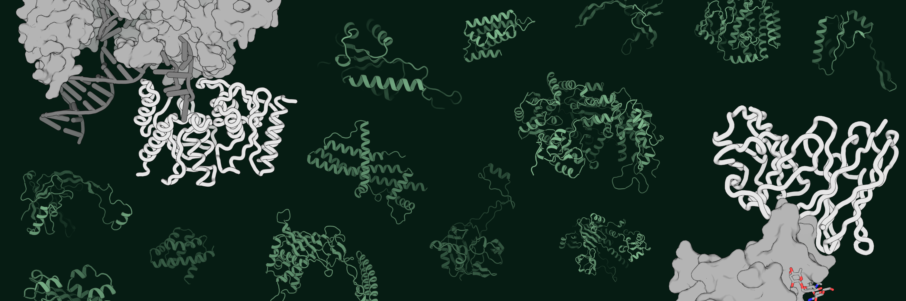

# proseLM

Official repository for [proseLM](https://www.biorxiv.org/content/10.1101/2024.08.03.606485v1), a protein language model for structure- and function-conditioned sequence generation.


## Citing this work

```bibtex
@article{ruffolo2024adapting,
  title={Adapting protein language models for structure-conditioned design},
  author={Ruffolo, Jeffrey A and Bhatnagar, Aadyot and Beazer, Joel and Nayfach, Stephen and Russ, Jordan and Hill, Emily and Hussain, Riffat and Gallagher, Joseph and Madani, Ali},
  journal={bioRxiv},
  year={2024},
}
```